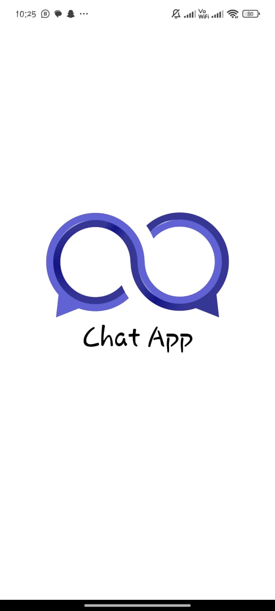
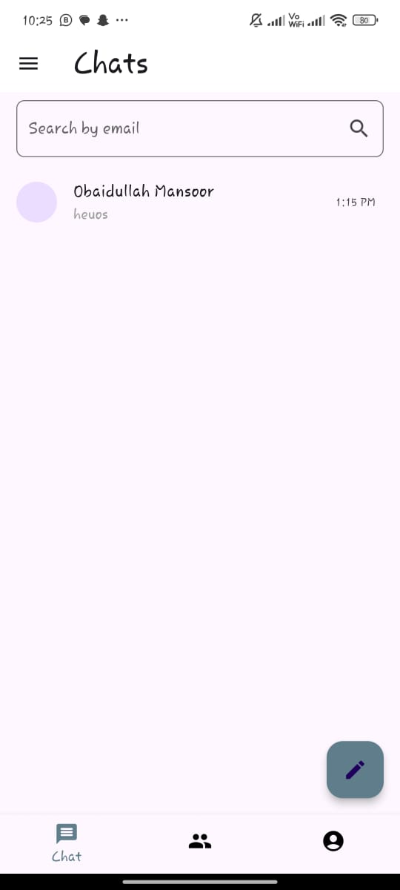
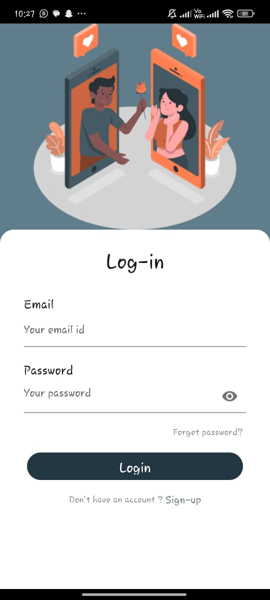
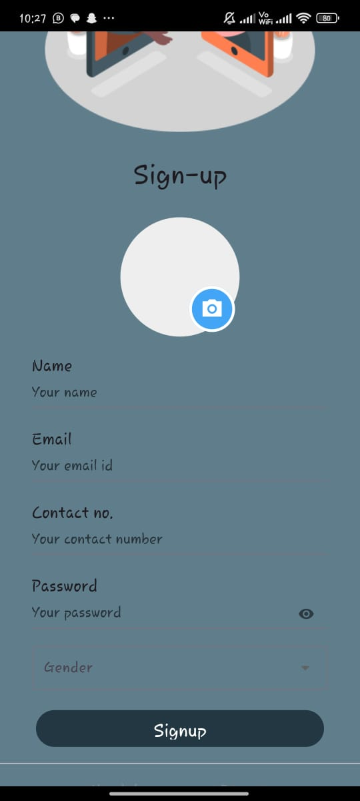
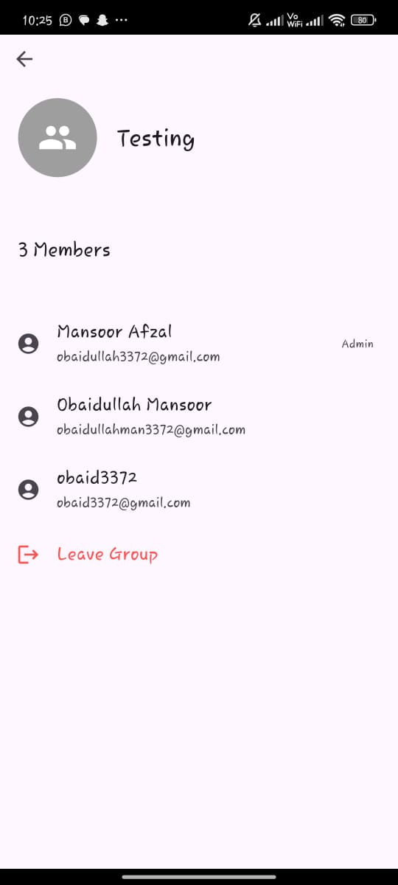
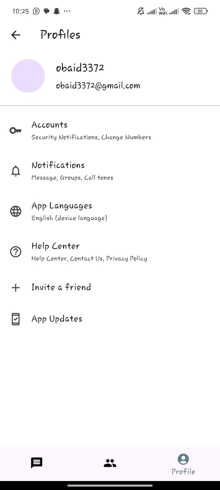

# ChatApp - Stay Connected with Your Friends 💬

**ChatApp** is a real-time messaging application where you can chat with your friends, create group chats, and stay connected. The app uses **Firebase** for real-time messaging, user authentication, and storage. It features one-on-one chat as well as group chat functionality.



---

## 📱 Features

- **Real-Time Chat**: Instant messaging with friends, powered by **Firebase**.
  

- **Group Chats**: Create and join group chats to stay in touch with multiple friends.
  

- **User Authentication**: Secure login and sign-up with **Firebase Authentication**.
  
  

- **Group Descriptions**: Set and view descriptions for your group chats.
  

- **Contact List**: Easily find and chat with your friends.
  

- **Profile Management**: Customize your user profile with personal details.
  

---

## 📸 Screenshots

| Splash Screen      | Login Screen      | Sign-Up Screen     |
|-------------------|-------------------|-------------------|
|  |  |  |

| Group Chat         | Chat Home         | Group List         |
|-------------------|-------------------|-------------------|
|  |  |  |

| Chat Screen        | Group Description | Contacts           |
|-------------------|-------------------|-------------------|
|  |  |  |

---

## 🛠️ Built With

- **Flutter**: Cross-platform mobile framework.
- **Firebase**: For real-time database, authentication, and cloud storage.
- **Dart**: Programming language used for building Flutter apps.

---

## 📂 Project Structure

```plaintext
chatapp/
│
├── lib/
│   ├── main.dart           # Entry point of the app
│   ├── screens/            # Screens like Login, Chat, Group Chat, Profile, etc.
│   ├── services/           # Firebase services for authentication, messaging, etc.
│   ├── models/             # Data models for User, Chat, Group, etc.
│   └── widgets/            # Reusable UI components
├── assets/                 # App assets (images, icons, animations)
└── pubspec.yaml            # Project dependencies
```

---

## 🚀 How to Run Locally

1. **Clone** the repository:
   ```bash
   git clone https://github.com/obaidullah72/chatapp.git
   cd chatapp
   ```

2. **Install dependencies**:
   ```bash
   flutter pub get
   ```

3. **Set up Firebase**:
   - Follow the [Firebase Setup Guide](https://firebase.google.com/docs/flutter/setup) to configure Firebase for your app.
   - Download the `google-services.json` (for Android) or `GoogleService-Info.plist` (for iOS) from the Firebase Console and add it to the respective platforms.

4. **Run the app**:
   ```bash
   flutter run
   ```

---

## 🌟 Features to Implement

- **Push Notifications**: Get real-time notifications for new messages.
- **Message Reactions**: Allow users to react to individual messages.
- **Read Receipts**: See when messages have been read.
- **Media Sharing**: Enable sharing of images, videos, and files in chats.

---

## 🤝 Contributing

We welcome contributions! Feel free to submit a **pull request** or open an issue to discuss improvements.

---

## 🛡️ License

This project is licensed under the **MIT License** – see the [LICENSE](LICENSE) file for details.

---

## 📬 Contact

For any questions or suggestions, feel free to reach out:

- **GitHub**: [obaidullah72](https://github.com/obaidullah72)
- **LinkedIn**: [obaidullah72](https://www.linkedin.com/in/obaidullah72/)

---

[](https://visitcount.itsvg.in)
